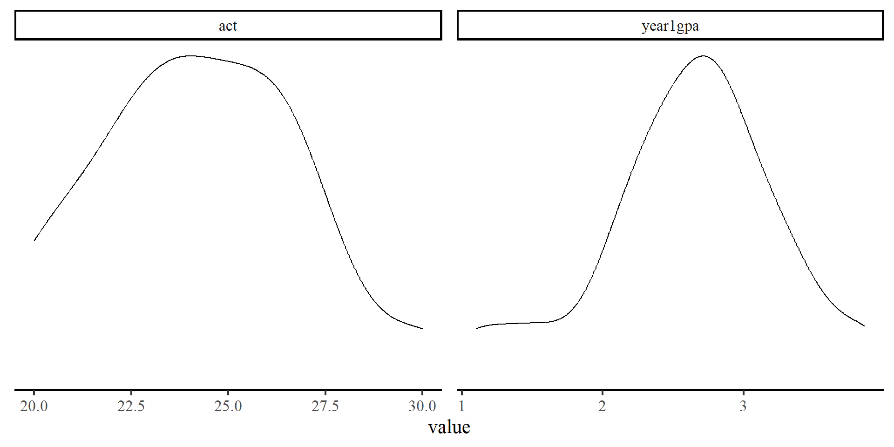
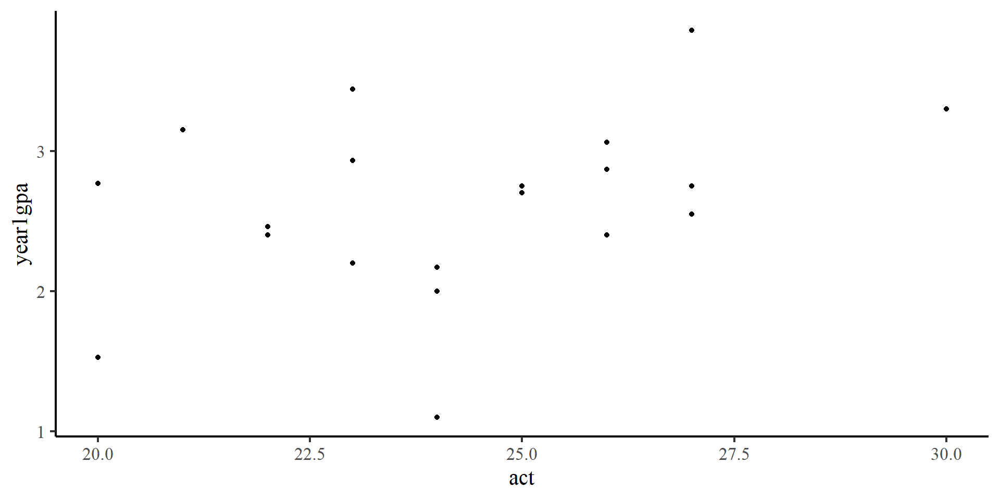
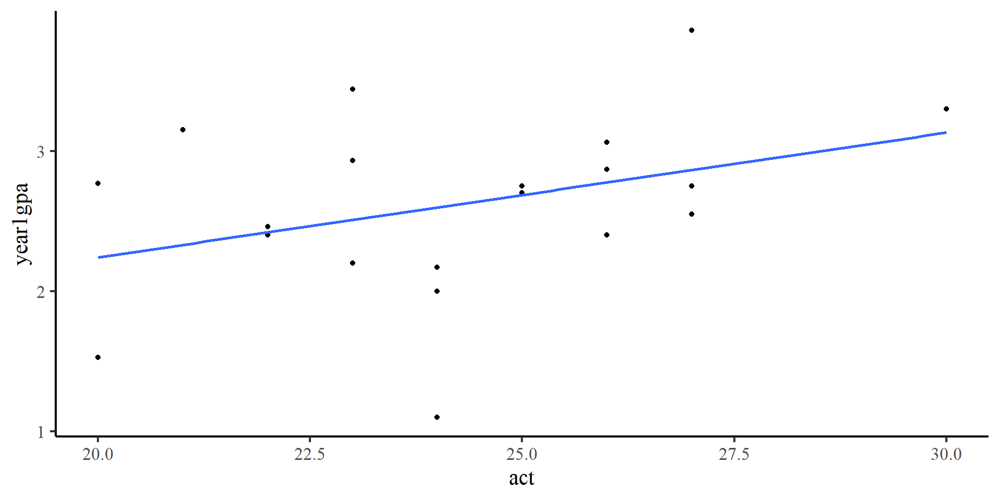
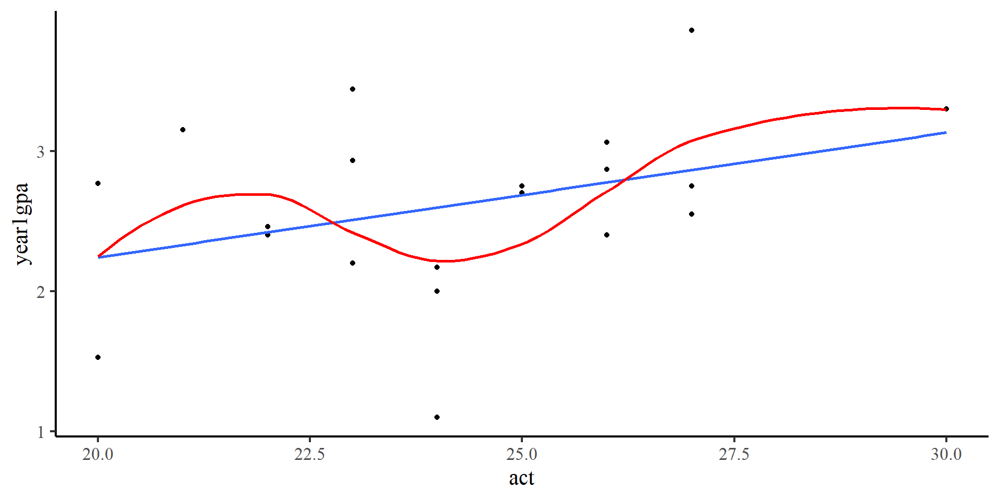
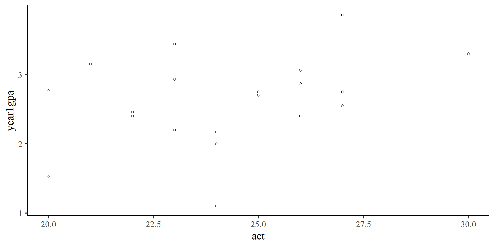
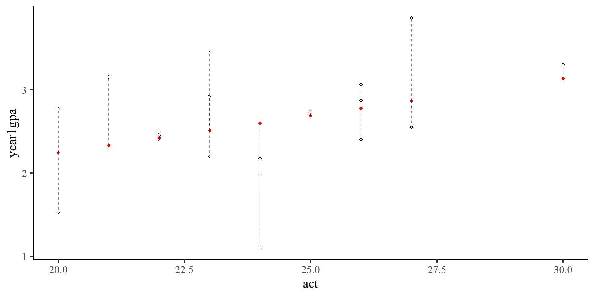
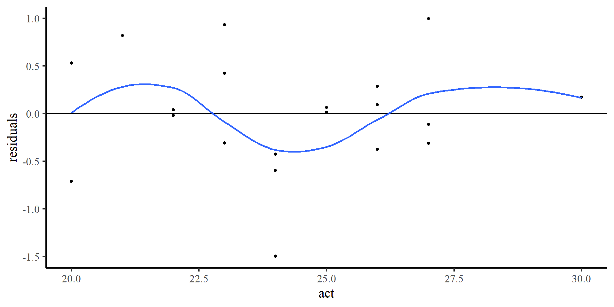
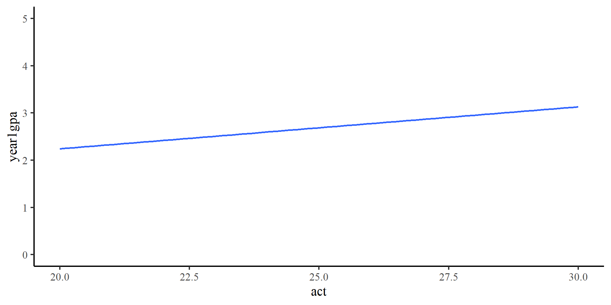

## Today's Packages 🤗

:::: {.columns}
::: {.column width="50%"}


::: {.cell .code-150}

```{.r .cell-code  code-fold="true" code-summary="Install Packages Code" code-line-numbers="false"}
install.packages("rio")
install.packages("psych")
install.packages("tidyverse")
install.packages("car")
```
:::

::: {.cell .code-150}

```{.r .cell-code  code-line-numbers="false"}
library(car)
library(rio)
library(psych)
library(tidyverse)
theme_set(theme_classic(base_size = 14, 
                        base_family = 'serif'))
```
:::


</br>

<div style="font-size: 26px">

::: {.panel-tabset}

### `car`

The `car` package [@Fox_etal_2024] contains many helper functions to analyze and explore regression results. It was originally created to be used along a regression book written by the same authors.

### `tidyverse`

The `tidyverse` package [@Wickham_RStudio_2023] loads a suite of packages that help with data cleaning and visualization. Among others, `tidyverse` loads both `dplyr` and `ggplot2`.

### `psych`

The `psych` package [@Revelle_2024a] includes MANY functions that help with data exploration and running analyses typically done in the social sciences.

:::
</div>

:::
::: {.column width="50%"}


<ul>

<li> Let's also load the data for today: </li>
</ul>


::: {.cell .code-125}

```{.r .cell-code  code-line-numbers="false"}
GPA <- import("https://github.com/quinix45/PSYC-7804-Regression-Lab-Slides/raw/refs/heads/main/Slides%20Files/Data/GPA.sav")

str(GPA, vec.len = 2)
```

::: {.cell-output .cell-output-stdout}

```
'data.frame':	20 obs. of  2 variables:
 $ year1gpa: num  1.53 2.77 3.15 2.4 2.46 ...
  ..- attr(*, "label")= chr "First-year college GPA"
  ..- attr(*, "format.spss")= chr "F8.2"
 $ act     : num  20 20 21 22 22 ...
  ..- attr(*, "label")= chr "ACT scores"
  ..- attr(*, "format.spss")= chr "F8.0"
```


:::
:::


:::
::::


## Describe and Plot your data

Whenever working with new data it's good practice to run descriptive statistics and visualizations

:::: {.columns}
::: {.column width="30%"}


::: {.cell}

```{.r .cell-code  code-line-numbers="false"}
describe(GPA)
```

::: {.cell-output .cell-output-stdout}

```
         vars  n  mean   sd median trimmed  mad  min   max range  skew kurtosis
year1gpa    1 20  2.62 0.64   2.72    2.65 0.49  1.1  3.86  2.76 -0.41     0.04
act         2 20 24.25 2.59  24.00   24.25 2.97 20.0 30.00 10.00  0.15    -0.66
           se
year1gpa 0.14
act      0.58
```


:::
:::


<br>

::: {.fragment fragment-index=1}

The two variables seem fairly normally distributed. 

:::

:::
::: {.column width="70%"}


::: {.cell}

```{.r .cell-code  code-fold="true" code-summary="Plot code" code-line-numbers="false"}
GPA %>% 
# When creating multiple plots at once, long data works best
pivot_longer(cols = colnames(GPA),
             names_to = "variable",
             values_to = "value") %>% 
          ggplot(aes(x  = value)) +
          geom_density() +
# the facet_wrap() fucntion generates plots for each value in "variable"
          facet_wrap(~variable, scales = "free") +
  theme(axis.title.y=element_blank(),
        axis.text.y=element_blank(),
        axis.ticks.y=element_blank(),
        axis.line.y =  element_blank())
```

::: {.cell-output-display}
{width=960}
:::
:::


:::
::::


## Scatterplot {auto-animate="true"}

A scatterplot is ideal for visualizing bivariate relations 

:::: {.columns}
::: {.column width="30%"}

We have seen this code before


::: {.cell}

```{.r .cell-code  code-line-numbers="false"}
ggplot(GPA,
      aes(x = act, y = year1gpa)) +
      geom_point()
```
:::


:::
::: {.column width="70%"}


::: {.cell}
::: {.cell-output-display}
{width=960}
:::
:::


:::
::::

::: {.fragment fragment-index=1}

There seems to be a positive trend (as ACT scores increase, first year GPA also increases). Let's draw a **regression line** to confirm that.  

:::

## Scatterplot {auto-animate="true" data-visibility="uncounted"}

A scatterplot is ideal for visualizing bivariate relations 

:::: {.columns}
::: {.column width="30%"}


::: {.cell}

```{.r .cell-code  code-line-numbers="false"}
ggplot(GPA,
      aes(x = act, y = year1gpa)) +
      geom_point() +
      geom_smooth(method = "lm", 
                  se = FALSE)
```
:::


:::
::: {.column width="70%"}


::: {.cell}
::: {.cell-output-display}
{width=960}
:::
:::


:::
::::

The **regression line** confirms our observation. 


## Scatterplot {auto-animate="true" data-visibility="uncounted"}

A scatterplot is ideal for visualizing bivariate relations 

:::: {.columns}
::: {.column width="30%"}


::: {.cell}

```{.r .cell-code  code-line-numbers="false"}
ggplot(GPA,
      aes(x = act, y = year1gpa)) +
      geom_point() +
      geom_smooth(method = "lm", 
                  se = FALSE) +
      geom_smooth(method = "loess",
                  color = "red",
                  se = FALSE)
```
:::


:::
::: {.column width="70%"}


::: {.cell}
::: {.cell-output-display}
{width=960}
:::
:::


:::
::::

::: {.fragment fragment-index=1}

<div style="font-size: 22px"> We can add a loess line, which usually helps with checking for **non-linear trends**. However, here it should probably not be trusted much. Why? Because there are too few points (only 20), and the loess line is influenced by just a few observations.  
  </div>

:::

## Correlation 

Correlation, usually denoted with $r$, measures the strength of linear association between two variables that ranges between $-1$ and $1$. 


:::: {.columns}
::: {.column width="50%"}


<center>


**The Math**

::: {.fragment fragment-index=1}

$r_{xy} = \frac{ \sum_{i=1}^{n}(x_i-\bar{x})(y_i-\bar{y}) }{\sqrt{\sum_{i=1}^{n}(x_i-\bar{x})^2}\sqrt{\sum_{i=1}^{n}(y_i-\bar{y})^2}}$

:::

</center>

::: {.fragment fragment-index=2}
Although this formula looks a bit scary, we can break it down in familiar elements:
:::

<ul style="font-size: 26px" >


::: {.fragment fragment-index=3}
<li> $\sum_{i=1}^{n}(x_i-\bar{x})(y_i-\bar{y})$ is the covariance (equivalent to correlation) between $x$ and $y$ </li> 
:::

::: {.fragment fragment-index=4}
<li> $\sqrt{\sum_{i=1}^{n}(x_i-\bar{x})^2}$ is equivalent to the variance of $x$ </li> 

<li> $\sqrt{\sum_{i=1}^{n}(y_i-\bar{y})^2}$ is equivalent to the variance of $y$ </li> 
:::
::: {.fragment fragment-index=5}
<div style="font-size: 22px"> all the denominator does is guarantee that $r$ is always between $-1$ and $1$. It *standardizes* the covariance. </div>
:::

</ul>

:::
::: {.column width="50%"}

<center>

**The code**

</center>

::: {.fragment fragment-index=6}

<div style="font-size: 26px">
Calculating correlations by hand is very simple in R
</div>


::: {.cell .code-125}

```{.r .cell-code  code-line-numbers="false"}
cov_xy <- sum((GPA$year1gpa - mean(GPA$year1gpa)) * (GPA$act - mean(GPA$act)))
var_x <- sqrt(sum((GPA$year1gpa - mean(GPA$year1gpa))^2))
var_y <- sqrt(sum((GPA$act - mean(GPA$act))^2))

cov_xy/(var_x * var_y)
```

::: {.cell-output .cell-output-stdout}

```
[1] 0.3606251
```


:::
:::


:::

::: {.fragment fragment-index=7}

<div style="font-size: 26px">
In practice you would just use the `cor()` function to calculate the correlation between two variables.
</div>


::: {.cell .code-150}

```{.r .cell-code}
cor(GPA$year1gpa, GPA$act)
```

::: {.cell-output .cell-output-stdout}

```
[1] 0.3606251
```


:::
:::


:::

:::
::::


## Significance Test for Correlations

The `cor()` function does not run any significance test for our correlations. To get significance tests for correlations, you can use the `corr_test()` function from the `psych` package

:::: {.columns}
::: {.column width="50%"}

::: {.fragment fragment-index=1}


::: {.cell .code-125}

```{.r .cell-code  code-line-numbers="false"}
# Note that the line below is equivalent to corr.test(GPA$year1gpa, GPA$act)
corr.test(GPA)
```

::: {.cell-output .cell-output-stdout}

```
Call:corr.test(x = GPA)
Correlation matrix 
         year1gpa  act
year1gpa     1.00 0.36
act          0.36 1.00
Sample Size 
[1] 20
Probability values (Entries above the diagonal are adjusted for multiple tests.) 
         year1gpa  act
year1gpa     0.00 0.12
act          0.12 0.00

 To see confidence intervals of the correlations, print with the short=FALSE option
```


:::
:::


:::

::: {.fragment fragment-index=2}

The output of `corr_test()` can be ever so slightly confusing 🤨 
:::

:::
::: {.column width="50%"}

::: {.fragment fragment-index=3}

<div style="font-size: 26px">
To get more insight into what `R` functions actually do, sometimes you want to save results as objects and explore the object content.
</div>


::: {.cell}

```{.r .cell-code  code-line-numbers="false"}
correlation <- corr.test(GPA)

# this prints the name of all the elements of the `correlation` object
names(correlation)
```

::: {.cell-output .cell-output-stdout}

```
 [1] "r"      "n"      "t"      "p"      "p.adj"  "se"     "sef"    "adjust"
 [9] "sym"    "ci"     "ci2"    "ci.adj" "stars"  "Call"  
```


:::
:::


:::

<br>

::: {.fragment fragment-index=4}

<div style="font-size: 26px">
Turns out the `corr_test()` function stores much more information than it lets on. This is the case for most `R` functions, which will save a lot of information inside a `list` object.
</div>

:::
:::
::::


## `corr_test()` output

:::: {.columns}
::: {.column width="40%"}


Keep an eye out for the matching output between the table below and the code on the right.

<br>


::: {.cell .code-125}

```{.r .cell-code  code-line-numbers="false"}
corr.test(GPA)
```

::: {.cell-output .cell-output-stdout}

```
Call:corr.test(x = GPA)
Correlation matrix 
         year1gpa  act
year1gpa     1.00 0.36
act          0.36 1.00
Sample Size 
[1] 20
Probability values (Entries above the diagonal are adjusted for multiple tests.) 
         year1gpa  act
year1gpa     0.00 0.12
act          0.12 0.00

 To see confidence intervals of the correlations, print with the short=FALSE option
```


:::
:::


:::
::: {.column width="60%"}

<ul style="font-size: 26px">

::: {.fragment fragment-index=1}
<li> The `r` element is the correlation matrix between our 2 variables </li>


::: {.cell .code-125}

```{.r .cell-code  code-line-numbers="false"}
correlation$r
```

::: {.cell-output .cell-output-stdout}

```
          year1gpa       act
year1gpa 1.0000000 0.3606251
act      0.3606251 1.0000000
```


:::
:::


:::

::: {.fragment fragment-index=2}

<li> The `p` element is the *p*-value for every element of the correlation matrix </li>


::: {.cell .code-125}

```{.r .cell-code  code-line-numbers="false"}
correlation$p
```

::: {.cell-output .cell-output-stdout}

```
          year1gpa       act
year1gpa 0.0000000 0.1182837
act      0.1182837 0.0000000
```


:::
:::


:::


::: {.fragment fragment-index=3}

<li> The `ci` element is the confidence interval (which is not printed by default) </li>


::: {.cell .code-125}

```{.r .cell-code  code-line-numbers="false"}
correlation$ci
```

::: {.cell-output .cell-output-stdout}

```
                lower         r     upper         p
yr1gp-act -0.09744666 0.3606251 0.6926154 0.1182837
```


:::
:::


:::

</ul>
:::
::::

## Running a Regreassion in R


To run regressions in R we use the `lm()` function (which stands for linear model). In the case of our data, we want to see whether ACT scores (`act`) predict GPA in the first year of college (`year1gpa`)


:::: {.columns}
::: {.column width="60%"}


::: {.cell .code-125}

```{.r .cell-code  code-line-numbers="false"}
reg <- lm(year1gpa ~ act, data = GPA)
summary(reg)
```

::: {.cell-output .cell-output-stdout}

```

Call:
lm(formula = year1gpa ~ act, data = GPA)

Residuals:
     Min       1Q   Median       3Q      Max 
-1.49728 -0.32916  0.02715  0.31914  0.99612 

Coefficients:
            Estimate Std. Error t value Pr(>|t|)
(Intercept)  0.46452    1.32082   0.352    0.729
act          0.08886    0.05417   1.640    0.118

Residual standard error: 0.6123 on 18 degrees of freedom
Multiple R-squared:  0.1301,	Adjusted R-squared:  0.08172 
F-statistic: 2.691 on 1 and 18 DF,  p-value: 0.1183
```


:::
:::


:::
::: {.column width="40%"}

`lm(Y ~ X, data = your data)` 

<ul style="font-size: 26px">


<li> `Y`: the name of your dependent variable (DV) </li>

<li> `X`: the name of your independent variable (IV) </li>

<li>  `data = your data`: The data that contains your variables </li>

</ul>

<div style="font-size: 22px">  
**NOTE**: if we were to just run `lm(year1gpa ~ act)`, we would get an error. Neither  `year1gpa` and `act` are objects in our `R` environment. We need to tell `R` where to find `year1gpa` and `act` by adding `data = GPA`. 
</div>


:::
::::


## Interpreting Regression Output

:::: {.columns}
::: {.column width="50%"}


::: {.cell .code-125}

```{.r .cell-code  code-line-numbers="false"}
reg <- lm(year1gpa ~ act, data = GPA)
summary(reg)
```

::: {.cell-output .cell-output-stdout}

```

Call:
lm(formula = year1gpa ~ act, data = GPA)

Residuals:
     Min       1Q   Median       3Q      Max 
-1.49728 -0.32916  0.02715  0.31914  0.99612 

Coefficients:
            Estimate Std. Error t value Pr(>|t|)
(Intercept)  0.46452    1.32082   0.352    0.729
act          0.08886    0.05417   1.640    0.118

Residual standard error: 0.6123 on 18 degrees of freedom
Multiple R-squared:  0.1301,	Adjusted R-squared:  0.08172 
F-statistic: 2.691 on 1 and 18 DF,  p-value: 0.1183
```


:::
:::


:::
::: {.column width="50%"}

$$Y = b_0 + b_1X + e$$

<ul style="font-size: 26px">

::: {.fragment fragment-index=1}

<li> $Y$ = The DV (`year1gpa`) </li>

:::

::: {.fragment fragment-index=2}

<li> $b_0 = 0.46$, the predicted value of $Y$ when $X = 0$, AKA the **intercept** </li>

:::

::: {.fragment fragment-index=3}

<li>  $b_1 = 0.09$, the predicted change in $Y$ per each 1-unit increase in $X$, AKA the **slope** </li>

:::

::: {.fragment fragment-index=4}

<li>  $X$ =  the IV (`act`) </li>

:::


::: {.fragment fragment-index=5}
<li>  $\epsilon = 0.61$, the expected spread of the residuals $e$ around the regression line, AKA the **residual variance**\* </li>
:::

</ul>

::: {.fragment fragment-index=5}
<div style="font-size: 22px"> 
\***NOTE**: if you just do applied research, you will probably never have to think about $\epsilon$. However, there is great insight gained into understanding why it's there (refer to appendix)

</div>
:::

:::
::::


## Standardized Regression Output

<div style="font-size: 26px">  To run standardized regression in R we first standardize our data. The `scale()` function standardizes (or mean-centers) data. The `scale()` function can be a bit particular ([see here](https://www.r-bloggers.com/2021/12/how-to-use-the-scale-function-in-r/){target="_blank"} if you have troubles with it) </div>


:::: {.columns}
::: {.column width="50%"}


::: {.cell .code-125}

```{.r .cell-code  code-line-numbers="false"}
GPA_std <- data.frame(scale(GPA))

reg_std <- lm(year1gpa ~ act, data = GPA_std)
summary(reg_std)
```

::: {.cell-output .cell-output-stdout}

```

Call:
lm(formula = year1gpa ~ act, data = GPA_std)

Residuals:
     Min       1Q   Median       3Q      Max 
-2.34329 -0.51515  0.04249  0.49945  1.55896 

Coefficients:
             Estimate Std. Error t value Pr(>|t|)
(Intercept) 1.172e-16  2.143e-01    0.00    1.000
act         3.606e-01  2.198e-01    1.64    0.118

Residual standard error: 0.9583 on 18 degrees of freedom
Multiple R-squared:  0.1301,	Adjusted R-squared:  0.08172 
F-statistic: 2.691 on 1 and 18 DF,  p-value: 0.1183
```


:::
:::


:::

::: {.column width="50%"}

::: {.fragment fragment-index=1}

The meaning of the results does not change, just the coefficients. So...

$$Y = 0 + .36X,$$

$.36$ is also the correlation coefficient between `act` and `year1gpa`. Just remember that X and Y are in standard deviation units.

:::


::: {.fragment fragment-index=2}
<div style="font-size: 22px"> 
🧐 Standardizing our variables simply changes measurement units. You can think of it as switching between degrees Fahrenheit and Celsius. the state of the world (temperature) remains the same, only the numbers that we use to describe it change 🧘
</div>
:::

:::
::::


## Predictions and residuals

The `lm()` objects also saves predictions for all data points ($\hat{Y}_i$) and the residuals for all data points ($e_i$).

:::: {.columns}
::: {.column width="50%"}
**Predictions**

::: {.fragment fragment-index=1}


::: {.cell .code-125}

```{.r .cell-code  code-line-numbers="false"}
predictions <- predict(reg)
str(predictions, give.attr = FALSE)
```

::: {.cell-output .cell-output-stdout}

```
 Named num [1:20] 2.24 2.24 2.33 2.42 2.42 ...
```


:::
:::


These are the predicted values of $Y$ given the observed $X$ values. 

:::

:::
::: {.column width="50%"}

**Residuals**


::: {.fragment fragment-index=2}


::: {.cell .code-125}

```{.r .cell-code  code-line-numbers="false"}
residuals <- resid(reg)
str(residuals, give.attr = FALSE)
```

::: {.cell-output .cell-output-stdout}

```
 Named num [1:20] -0.7118 0.5282 0.8193 -0.0196 0.0404 ...
```


:::
:::


<div style="font-size: 24px">  These are the differences between the *observed* values of $Y$ and the *predicted* values of $Y$, so $e_i = Y_i - \hat{Y}_i$. </div>
:::

::: {.fragment fragment-index=3}
The residuals always sum to 0: 


::: {.cell .code-125}

```{.r .cell-code  code-line-numbers="false"}
sum(residuals)
```

::: {.cell-output .cell-output-stdout}

```
[1] 4.024558e-16
```


:::
:::


:::

:::
::::

::: {.fragment fragment-index=4}
::: {.callout-note}
## Dimensions of Objects
You should notice that both `predictions` and  `residuals` are vectors of length 20. This may seem obvious (if it is not, give it some thought), but checking the **dimensions** of objects is always a good way of making sure that you are getting what you expected from an R function. 
:::
:::

## Visualizing Predictions and Residuals {auto-animate="true"}

:::: {.columns}
::: {.column width="30%"}


::: {.cell .code-125}

```{.r .cell-code  code-line-numbers="false"}
ggplot(GPA,
 aes(x = act, y = year1gpa)) +
 geom_point(shape = 1) 
```
:::


<ul style="font-size: 26px">

<li> The *black circles* are the observed data points.</li>

</ul>


:::
::: {.column width="70%"}


::: {.cell}
::: {.cell-output-display}
{width=960}
:::
:::


:::
::::


## Visualizing Predictions and Residuals {auto-animate="true" data-visibility="uncounted"}

:::: {.columns}
::: {.column width="30%"}


::: {.cell .code-125}

```{.r .cell-code  code-line-numbers="false"}
ggplot(GPA,
 aes(x = act, y = year1gpa)) +
 geom_point(shape = 1) +
 geom_point(aes(y = predictions), 
                colour = "red")
```
:::


<ul style="font-size: 26px">

<li> The *black circles* are the observed data points.</li>

<li> The *red dots* are the predicted values for our data points. </li>

</ul>

:::

::: {.column width="70%"}


::: {.cell}
::: {.cell-output-display}
{width=960}
:::
:::


:::
::::

## Visualizing Predictions and Residuals {auto-animate="true" data-visibility="uncounted"}

:::: {.columns}
::: {.column width="30%"}


::: {.cell .code-115}

```{.r .cell-code  code-line-numbers="false"}
ggplot(GPA,
 aes(x = act, y = year1gpa)) +
 geom_point(shape = 1) +
 geom_point(aes(y = predictions), 
                color = "red") +
 geom_segment(y = predictions,
              x = GPA$act,
              xend = GPA$act,
              yend = GPA$year1gpa,
              linetype = 2,
              alpha = .5)
```
:::


<ul style="font-size: 24px">

<li> The *black circles* are the observed data points.</li>

<li> The *red dots* are the predicted values for our data points. </li>

<li> The *length of the dashed lines* are the residuals, which represent the difference between observed values (black circles) and predicted values (red dots) </li>

</ul>

:::

::: {.column width="70%"}


::: {.cell}
::: {.cell-output-display}
{width=960}
:::
:::


:::
::::

## Normality of Residuals

The fact that residuals must be normally distributed (and have a mean of 0) is an assumption built into regression (why? The appendix explains it). QQplots can help us infer how much residuals deviate from normality.

:::: {.columns}
::: {.column width="30%"}

::: {.fragment fragment-index=1}

The `qqPlot()` function from the `car` package is helpful here:


::: {.cell .code-125}

```{.r .cell-code  code-line-numbers="false"}
qqPlot(reg, id = FALSE)
```
:::


As long as the residuals (dots) are within the band, there should be no cause for concern.

:::

:::
::: {.column width="70%"}

::: {.fragment fragment-index=1}


::: {.cell .code-125}
::: {.cell-output-display}
{width=960}
:::
:::


:::

:::
::::

## Plotting Residuals Against Predictors

Another way of checking that residuals are evenly distributed around 0, and do not show any type of relationship with the predictor. 

:::: {.columns}
::: {.column width="30%"}

::: {.fragment fragment-index=1}


::: {.cell .code-125}

```{.r .cell-code  code-line-numbers="false"}
ggplot(GPA, 
  aes(x = act, y = residuals)) +
  geom_point() +
  geom_hline(yintercept = 0) +
  geom_smooth(method = "loess",
              se = FALSE)
```
:::


Once again, the loess line does not do too well because there are few points. The points look reasonably distributed around the 0 line to me.

:::

:::
::: {.column width="70%"}

::: {.fragment fragment-index=1}


::: {.cell}
::: {.cell-output-display}
{width=960}
:::
:::


:::

:::
::::


## References 

<div id="refs"> </div>


# Appendix: The true Regression Model and its assumptions {data-visibility="uncounted"}


## The "true" Regression Model

You may have seen regression model formulated in different ways. Turns out, the notation can have subtle differences that changes the meaning of what you are looking at:


:::: {.columns}
::: {.column width="50%"}


<ul style="font-size: 24px">  

$Y_i = b_0 + b_1X_i + e_i$ 


$\hat{Y_i} = b_0 + b_1X_i$ 


$\hat{Y} = b_0 + b_1X$ 

Where

<li> $Y_i$: the *observed* $Y$ value of participant $i$ </li>


<li> $\hat{Y_i}$: the *predicted* $Y$ value of participant $i$ </li>


<li> $\hat{Y}$: the *predicted* $Y$ value (e.g., predictions on data not yet observed) </li>


</ul>


:::
::: {.column width="50%"}

Now, the "real" regression model is actually

$Y \sim N(\mu = b_0 + b_1X, \sigma = \epsilon)$

Equivalently, you may see this written as

$Y = b_0 + b_1X + e$ where, $e \sim N(\mu = 0, \sigma = \epsilon)$


The second formulation is more explicit about the main assumption of regression, that the residuals, $e$, are normally distributed. Let's explore a bit more...

<div style="font-size: 22px"> **NOTE**: regression makes no assumption about the distribution of the predictors (i.e., $X$ need not to be normally distributed, regression does not care) </div>

:::
::::


## The Data Generating Process

On the previous slide you saw we had $Y_i$, $\hat{Y_i}$, $\hat{Y}$, and crucially, just $Y$ (). One important thing to keep in mind is that, whenever we run statistics, the question that we are asking is really...

<div style="font-size: 34px"> <center> **What is the probabilistic process by which the data that I observed came into existence? (i.e., the data generating process)** </center> </div>

:::: {.columns}
::: {.column width="50%"}

Likewise, regression tries to answer how your observed sample of the $Y$ random variable comes into existence. 

<br>

The $Y \sim N(b_0 + b_1X, \epsilon)$ (for simplicity, I dropped the $\mu$ and $\sigma$) is how linear regression thinks $Y$ crosses over the dotted line and ends up in our data. 
:::
::: {.column width="50%"}

{width="76%"}

:::
::::

## The Meaning of A regression model


:::: {.columns}
::: {.column width="50%"}

The regression output was:


::: {.cell .code-125}

```{.r .cell-code  code-line-numbers="false"}
summary(reg)
```

::: {.cell-output .cell-output-stdout}

```

Call:
lm(formula = year1gpa ~ act, data = GPA)

Residuals:
     Min       1Q   Median       3Q      Max 
-1.49728 -0.32916  0.02715  0.31914  0.99612 

Coefficients:
            Estimate Std. Error t value Pr(>|t|)
(Intercept)  0.46452    1.32082   0.352    0.729
act          0.08886    0.05417   1.640    0.118

Residual standard error: 0.6123 on 18 degrees of freedom
Multiple R-squared:  0.1301,	Adjusted R-squared:  0.08172 
F-statistic: 2.691 on 1 and 18 DF,  p-value: 0.1183
```


:::
:::


:::
::: {.column width="50%"}

if $Y \sim N(b_0 + b_1X, \epsilon)$ is our model...

...what we are saying with the results on the left is that $Y$ is normally distributed with 

- **mean**  of $0.46 +  0.08X_{ACT}$, the $b_0 + b_1X$ part, and 

- **standard deviation** of $0.61$, the $\epsilon$ (residual variance) part.


Let's look a bit more into the mean and standard deviation are.
:::
::::

## Predictable and Unpredictable Parts

You think of the normal distribution as a predictable and unpredictable part. The predictable part is the mean, whereas the unpredictable part is the standard deviation. 

:::: {.columns}
::: {.column width="50%"}

For example, if I generate data from a normal distribution with 0 standard deviation


::: {.cell .code-125}

```{.r .cell-code  code-line-numbers="false"}
# generate 5 observations from N~(2, 0)
rnorm(5, mean = 2, sd = 0)
```

::: {.cell-output .cell-output-stdout}

```
[1] 2 2 2 2 2
```


:::
:::


The outcome is fully predictable, and we always get 2. 

:::
::: {.column width="50%"}


::: {.cell .code-125}

```{.r .cell-code  code-line-numbers="false"}
set.seed(2356)
# add randomness to observations on the left
rnorm(5, mean = 2, sd = 0) + 
rnorm(5, mean = 0, sd = 4) 
```

::: {.cell-output .cell-output-stdout}

```
[1]  1.416078  1.911307 -1.559635 -5.324674  2.095688
```


:::

```{.r .cell-code  code-line-numbers="false"}
# the two lines above are equivalent to just
# set.seed(2356)
# rnorm(5, mean = 2, sd = 4) 
```
:::


In contrast, here we know that our values will be centered around 2, the mean. However, there is unpredictable randomness introduced by the standard deviation of 4. 

:::
::::

In regression, we swap the mean of the normal distribution for the **regression line** (predictable part), and the randomness for $\epsilon$, the **residual variance** (unpredictable part). 


## A Visual Representation

We can visualize what our $Y$ variable should look like according to our regression model in a *perfect world*. 

:::: {.columns}
::: {.column width="30%"}


::: {.cell .code-125}

```{.r .cell-code  code-line-numbers="false"}
ggplot(GPA, 
  aes(x = act, y = year1gpa)) +  
  # assume we have no data yet
  geom_point(alpha = 0) +
      geom_smooth(method = "lm", se = FALSE) +
  ylim(0, 5)
```
:::


The line is what the *mean* of `year1gpa` should be at every value of `act`. However, there is no data yet.
:::
::: {.column width="70%"}


::: {.cell}
::: {.cell-output-display}
{width=960}
:::
:::


:::
::::

## A Visual Representation


We can visualize what our $Y$ variable should look like according to our regression model in a *perfect world*. 

:::: {.columns}
::: {.column width="30%"}


::: {.cell .code-125}

```{.r .cell-code  code-fold="true" code-summary="Plot Code" code-line-numbers="false"}
# Generate idealized data

set.seed(7757)

# generate X values
X <- rep(seq(min(GPA$act), max(GPA$act), by =.1), 150)

# the code below generates data according to the regression model

intercept <- coef(reg)[1]
slope <- coef(reg)[2]
residual_var <- sigma(reg)

ideal_data <- rnorm(length(X), mean = intercept + X*slope, sd = sigma(reg))

# plot the idealized data

ggplot(mapping =  aes(x = X, y = ideal_data)) +  
  geom_point(alpha = .2)+
      geom_smooth(method = "lm", se = FALSE)+
  ylim(0, 5)
```
:::


Each "column of dots" is normally distributed around the line, with standard deviation of $.61$, the residual variance ($\epsilon$). The dots are our residuals, $e$. 


*This is the data our regression model expects to see*
:::
::: {.column width="70%"}


::: {.cell}
::: {.cell-output-display}
{width=960}
:::
:::


:::
::::

The $Y$ variable looking like this is the only "assumption" of regression.

## Statistical Models VS Reality


:::: {.columns}
::: {.column width="50%"}

The $Y$ variable never looks like this.


::: {.cell}
::: {.cell-output-display}
{width=960}
:::
:::


:::
::: {.column width="50%"}

This is what the $Y$ variable looks like usually (our data).


::: {.cell}
::: {.cell-output-display}
{width=960}
:::
:::


:::
::::

<div style="font-size: 22px"> Violating assumptions? Assumptions are $always$ "violated". To "check assumptions" is knowing what data your model expects to see and evaluating how different the observed data is (QQplots for example, help you do this). </div>

<div style="font-size: 22px">  
Whether you think your observed data it "too different" from the expected data is usually a *very subjective* process. 
</div>


  
