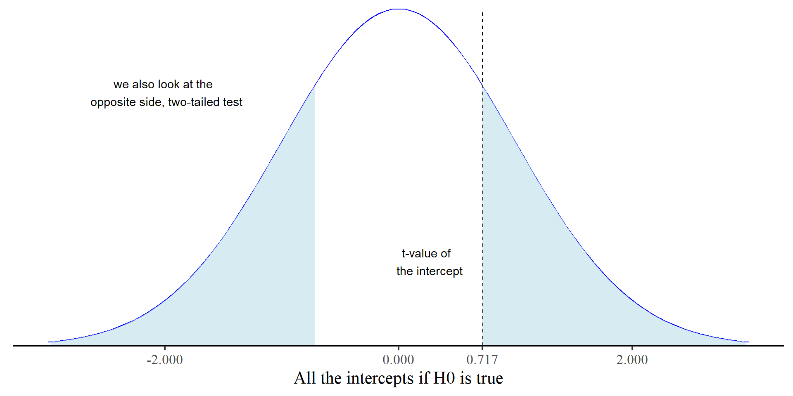

## Today's Packages 🤗

:::: {.columns}
::: {.column width="50%"}


::: {.cell .code-150}

```{.r .cell-code  code-fold="true" code-summary="Install Packages Code" code-line-numbers="false"}
install.packages("flextable")
install.packages("rio")
install.packages("tidyverse")
```
:::

::: {.cell .code-150}

```{.r .cell-code  code-line-numbers="false"}
library(flextable)
library(rio)
library(tidyverse)
theme_set(theme_classic(base_size = 14, 
                        base_family = 'serif'))
```
:::


</br>

<div style="font-size: 26px">

::: {.panel-tabset}


### `flextable`

The `flextable` package [@Gohel_etal_2024] helps create pretty tables from R. Can also be used to create publication ready APA style tables.

### `rio`

The `rio` package [@Becker_etal_2024] developers describe this package as the *Swiss-Army Knife for Data I/O*. The `import()` and `export()` functions can import/export just about any data type.

### `tidyverse`

The `tidyverse` package [@Wickham_RStudio_2023] loads a suite of packages that help with data cleaning and visualization. Among others, `tidyverse` loads both `dplyr` and `ggplot2`.


:::
</div>

:::
::: {.column width="50%"}


<ul>

<li> Let's also load the [data](https://www.kaggle.com/datasets/mirichoi0218/insurance?resource=download){target="_blank"}
 for today: </li>
</ul>


::: {.cell .code-125}

```{.r .cell-code  code-line-numbers="false"}
insurance <- import("https://github.com/quinix45/PSYC-7804-Regression-Lab-Slides/raw/refs/heads/main/Slides%20Files/Data/insurance.csv")

# let's peak at our variables
str(insurance)
```

::: {.cell-output .cell-output-stdout}

```
'data.frame':	1338 obs. of  7 variables:
 $ age     : int  19 18 28 33 32 31 46 37 37 60 ...
 $ sex     : chr  "female" "male" "male" "male" ...
 $ bmi     : num  27.9 33.8 33 22.7 28.9 ...
 $ children: int  0 1 3 0 0 0 1 3 2 0 ...
 $ smoker  : chr  "yes" "no" "no" "no" ...
 $ region  : chr  "southwest" "southeast" "southeast" "northwest" ...
 $ charges : num  16885 1726 4449 21984 3867 ...
```


:::
:::


:::
::::

## Predicting Insurance Charges

Let's find out whether body mass index (`bmi`) predicts health insurance charges (`charges`)


:::: {.columns}
::: {.column width="60%"}


::: {.cell .code-125}

```{.r .cell-code  code-line-numbers="false"}
reg <- lm(charges ~ bmi, insurance)
summary(reg)
```

::: {.cell-output .cell-output-stdout}

```

Call:
lm(formula = charges ~ bmi, data = insurance)

Residuals:
   Min     1Q Median     3Q    Max 
-20956  -8118  -3757   4722  49442 

Coefficients:
            Estimate Std. Error t value Pr(>|t|)    
(Intercept)  1192.94    1664.80   0.717    0.474    
bmi           393.87      53.25   7.397 2.46e-13 ***
---
Signif. codes:  0 '***' 0.001 '**' 0.01 '*' 0.05 '.' 0.1 ' ' 1

Residual standard error: 11870 on 1336 degrees of freedom
Multiple R-squared:  0.03934,	Adjusted R-squared:  0.03862 
F-statistic: 54.71 on 1 and 1336 DF,  p-value: 2.459e-13
```


:::
:::


:::


::: {.column width="40%"}

The resulting predicted charge is:

<div style="font-size: 22px">

$\widehat{\mathrm{Charges}}_i = \$1192.94 + \$393.87 \times \mathrm{BMI}_i$

</div>

Is the intercept meaningful in this case?

</br>

In practice, before we interpret anything, we need to check the *p*-values associated with our output.  

:::
::::

## *p*-values

Some guy named [RA Fisher](https://en.wikipedia.org/wiki/Ronald_Fisher) came up with the idea of *p*-values. The set up goes something like this:

:::: {.columns}
::: {.column width="80%"}

<ol style="font-size: 24px">

<li> I collected this sample and found that BMI predicts how much insurance will charge. But what do these results tell me anything about the [population](https://en.wikipedia.org/wiki/Statistical_population){target="_blank"}? I can't really measure the entire population 🫤 </li>

<li> 💡 Let resample from the population and repeat my experiment in *exactly the same way* an infinite number of times and see how often I get my result, a slope of 393.87, *or more*. Let me also assume that in reality there truly is no relation between BMI and insurance charge, and the slope is exactly 0 in reality ($H_0$, the null hypothesis) </li>

<li> Under the assumptions that the true population slope is exactly 0, the ***p*-value** is the proportion of times that I find a slope of 393.87 or more if I were to repeat exactly the same experiment an infinite number of times. </li>
</ol>

Fisher, being really good at math and knowing the [central limit theorem](https://gallery.shinyapps.io/CLT_mean/){target="_blank"}
, realized that we don't have to repeat experiments an infinite number of times (ok, thank you Fisher 😌).

:::
::: {.column width="20%"}

<br>

<figure>
  
  <figcaption style="font-size: 16px">R. A. Fisher (1890-1962), really good at math and stats, but also a pretty bad person</figcaption>
</figure>


:::
::::

## Sampling Distributions

<div style="font-size: 26px">  Given *most* statistics, we can figure out what a distribution of the results of an infinite number of experiments will look like. This is known as the **sampling distribution**, and is the target of significance testing. </div> 


:::: {.columns}
::: {.column width="30%"}


<div style="font-size: 22px; padding-top: 12px;"> 
If we assume the our slope really should be 0 (i.e., we assume $H_0$ is true), the sampling distribution should look something like the plot on the right:
</div> 

<ul style="font-size: 22px">

<li> Our value for the slope was $393.87$, which is way far off to the right. That means $393.87$ is extremely unlikely to come from a sampling distribution where $H_0$ is true. </li>

<li> The ***p*-value**, which is $2.46*10^{-13}$, represents the probability of getting our slope (or a value more extreme), from the plot on the right (i.e., if $H_0$ is true). ***p*-values** say nothing about how likely/unlikely $H_1$ is. </li>

</ul>


:::
::: {.column width="70%"}


::: {.cell}

```{.r .cell-code  code-fold="true" code-summary="Plot code" code-line-numbers="false"}
# you need to install this package 
library(extraDistr)

ggplot() +
  geom_function(fun = dlst, args = list(mu = 0, sigma = 53.25, df = 1336), color = "blue") +
  labs(x = "All the slopes if H0 is true") +
  xlim(-(53.25*3), (53.25*3)) +
  scale_y_continuous(expand = c(0,0)) +
  theme(axis.title.y=element_blank(),
        axis.text.y=element_blank(),
        axis.ticks.y=element_blank(),
        axis.line.y =  element_blank())
```

::: {.cell-output-display}
{width=960}
:::
:::


:::
::::


## Where's the T 🍵?

<div style="font-size: 26px"> How did I get a *p*-value without any *t*-value? Although the plot on the previous slide looked like a normal distribution, it was actually a *t*-distribution with $\mu = 0$, $\sigma = 53.25$ and $df = 1336$. Just like any normal distribution, the units can be standardized such that $\sigma = 1$, resulting in the graph below to the right. </div>


:::: {.columns}
::: {.column width="30%"}

<div style="font-size: 24px; padding-top: 12px;">  This implies also rescaling our slope to get a value that can be place it on the new x-axis, thus we compute the **t-statistic**: </div>

$$t = \frac{b_1}{SE_{b_1}} = \frac{393.87}{53.25} = 7.397 $$


::: {.cell .code-125}

```{.r .cell-code  code-line-numbers="false"}
pt(7.397, df = 1336, lower.tail = FALSE)*2
```

::: {.cell-output .cell-output-stdout}

```
[1] 2.451523e-13
```


:::
:::


The *p*-value is the same as the regression output. 

:::
::: {.column width="70%"}


::: {.cell}

```{.r .cell-code  code-fold="true" code-summary="Plot code" code-line-numbers="false"}
ggplot() +
  geom_function(fun = dt, args = list(df = 1336), color = "blue") +
  labs(x = "All the slopes if H0 is true, but standardized") +
  xlim(-3, 3) +
  scale_y_continuous(expand = c(0,0)) +
  theme(axis.title.y=element_blank(),
        axis.text.y=element_blank(),
        axis.ticks.y=element_blank(),
        axis.line.y =  element_blank())
```

::: {.cell-output-display}
{width=960}
:::
:::


:::
::::

## ...And the intercept

<div style="font-size: 26px"> Usually, we don't really care about the intercept, but here it illustrate where *t*-values fall when the corresponding *p*-value is high. </div> 

:::: {.columns}
::: {.column width="30%"}

<div style="font-size: 24px; padding-top: 18px; padding-bottom: 18px;"> Form the outptut, $t = \frac{b_0}{SE_{b_0}} = \frac{1192.94}{1664.80} = 0.717$. This time, the *t*-value is pretty close to the center of the plot </div>


::: {.cell .code-125}

```{.r .cell-code  code-line-numbers="false"}
pt(.717, df = 1336, lower.tail = FALSE)*2
```

::: {.cell-output .cell-output-stdout}

```
[1] 0.4734994
```


:::
:::


<ul style="font-size: 22px">

<li> So, even by random chance, there is about a $47\%$ chance of getting a value of $1192.94$ *or more extreme*. </li>

**NOTE**: the total area under the curve is $1$, and the shaded area is $0.473$, the *p*-value. </li>

</ul>

:::
::: {.column width="70%"}


::: {.cell}

```{.r .cell-code  code-fold="true" code-summary="Plot code" code-line-numbers="false"}
##| dpi: 300


ggplot() +
  geom_function(fun = dt, args = list(df = 1336), color = "blue") +
  labs(x = "All the intercepts if H0 is true") +
  geom_vline(xintercept = 0.717, linetype = 2) +
  xlim(-3, 3) +
  annotate("text", x = .25, y = .1, label = "t-value of \n the intercept") +
  annotate("text", x = -2, y = .3, label = "we also look at the \n opposite side, two-tailed test") +
    geom_ribbon(data = data.frame(x = seq(0.717, 4, length.out = 100)), 
              aes(x = x, ymin = 0, ymax = dt(x, df = 1336)), 
              fill = "lightblue", alpha = 0.5) +
  geom_ribbon(data = data.frame(x = seq(-0.717, -4, length.out = 100)), 
              aes(x = x, ymin = 0, ymax = dt(x, df = 1336)), 
              fill = "lightblue", alpha = 0.5) +
  scale_y_continuous(expand = c(0,0)) +
  scale_x_continuous(limits = c(-3, 3), breaks = c(-2, 0, 0.717, 2)) +
  theme(axis.title.y=element_blank(),
        axis.text.y=element_blank(),
        axis.ticks.y=element_blank(),
        axis.line.y =  element_blank())
```

::: {.cell-output-display}
{width=960}
:::
:::


:::
::::

## Type I Error Rate and Significance 

*p*-values have meaning even without any significance test. *Significance tests* happen only once we choose to make binary decisions based on *p*-values. At some point some folks decided that $p < .05 =$ *significant*. But,

> surely, God loves the .06 nearly as much as the .05 [@Rosnow_Rosenthal_1989, p. 1277]

Type I error rate ($\alpha$) is thus not a bug of significance testing; it's a feature. Turning *p*-values into binary decisions (accept/reject $H_0$) implies that there is always a non-zero chance (the *p*-value being that chance) that our results come from $H_0$ (i.e., we are wrong). 

So, significance testing is like gambling 🎰, where we think a 1 in 20 or less chances of being wrong is good odds. Sometimes we end up on the wrong side of chance, and we make the wrong conclusion. 

And slightly unsettling is the fact that you cannot know which of you decisions based on *p*-values is the "wrong" one 😧.  


## Confidence Intervals

We can also easily extract $95\%$ confidence intervals (CIs) for our intercept and slope:

:::: {.columns}
::: {.column width="60%"}


::: {.cell .code-150}

```{.r .cell-code  code-line-numbers="false"}
confint(reg)
```

::: {.cell-output .cell-output-stdout}

```
                 2.5 %    97.5 %
(Intercept) -2072.9743 4458.8487
bmi           289.4089  498.3372
```


:::
:::


:::
::: {.column width="40%"}

Confidence intervals carry the same information as *p*-values. The respective *p*-value will be significant if the confidence interval does not include 0. 

:::
::::


Now, as mention in the main lecture:


<ul style="font-size: 28px">

<li> **Incorrect interpretation**: "There is a 95% chance that the true value is within the confidence interval." </li>

**Correct interpretation**: "If I were to repeat the experiment an infinite number of times, 95% of my observed values would be within the confidence interval." </li>

</ul>

I will not elaborate further, but see [here](https://stats.stackexchange.com/questions/2272/whats-the-difference-between-a-confidence-interval-and-a-credible-interval){target="_blank"} for more.

## APA Style Report

...ok, I am done rambling, here's how you report the results in APA style:

:::: {.columns}
::: {.column width="50%"}


::: {.cell .code-125}

```{.r .cell-code  code-line-numbers="false"}
summary(reg)
```

::: {.cell-output .cell-output-stdout}

```

Call:
lm(formula = charges ~ bmi, data = insurance)

Residuals:
   Min     1Q Median     3Q    Max 
-20956  -8118  -3757   4722  49442 

Coefficients:
            Estimate Std. Error t value Pr(>|t|)    
(Intercept)  1192.94    1664.80   0.717    0.474    
bmi           393.87      53.25   7.397 2.46e-13 ***
---
Signif. codes:  0 '***' 0.001 '**' 0.01 '*' 0.05 '.' 0.1 ' ' 1

Residual standard error: 11870 on 1336 degrees of freedom
Multiple R-squared:  0.03934,	Adjusted R-squared:  0.03862 
F-statistic: 54.71 on 1 and 1336 DF,  p-value: 2.459e-13
```


:::
:::


:::

::: {.column width="50%"}

<div style="font-size: 36px"> 
::: {.callout-note}

## APA style report

Simple linear regression analysis indicated that BMI significantly positively predicted insurance charges, *b* = 393.87, *t*(1336) = 7.4, *p* < .001, 95\%CI [289.41; 498.34]. The predictor explained a significant proportion of variance in insurance charges,  *R*<sup>2</sup> = .04, *F*(1, 1336) = 54.71, *p* < .001. 
::: 
</div>

Although not discussed in this lab, we will return to $R^2$ soon. 
:::
::::


## ANOVA Output

If for some reason you prefer the ANOVA-type outputs, you can also get that for any type of `lm()` regression

:::: {.columns}
::: {.column width="40%"}

<br>


::: {.cell .code-125}

```{.r .cell-code  code-line-numbers="false"}
anova(reg)
```

::: {.cell-output .cell-output-stdout}

```
Analysis of Variance Table

Response: charges
            Df     Sum Sq    Mean Sq F value    Pr(>F)    
bmi          1 7.7134e+09 7713391237  54.709 2.459e-13 ***
Residuals 1336 1.8836e+11  140988645                      
---
Signif. codes:  0 '***' 0.001 '**' 0.01 '*' 0.05 '.' 0.1 ' ' 1
```


:::
:::


:::
::: {.column width="60%"}

<br>

Later in the course, we will learn all about how ANOVA is a regression is disguise 🥸. 

<br>

For now, notice that this ANOVA output provides the same *F*-statistic and *p*-value that were in the output for the $R^2$ on the previous slide. 

:::
::::


## Creating APA Style regression tables

While I was working on a paper, I created a function that generates APA style regression tables. The code is [here](https://github.com/quinix45/PSYC-7804-Regression-Lab-Slides/blob/main/Slides%20Files/R_scripts/Regression_flextable.R){target="_blank"}


:::: {.columns}
::: {.column width="60%"}


::: {.cell .code-125}

```{.r .cell-code  code-line-numbers="false"}
# load the function (`source()` runs R code from other files)
source("https://github.com/quinix45/PSYC-7804-Regression-Lab-Slides/raw/refs/heads/main/Slides%20Files/R_scripts/Regression_flextable.R")

# any regression model
reg_model <- lm(charges ~ bmi + sex, insurance)

# create the table
table <- regression_flextable(reg_model)

# save the table to as a word doc. You should see the files in the `path` argument appear in your working directory
save_as_docx(table, path = "reg_table.docx")
```
:::


<ul>
<li> The `save_as_...` functions that save the table to a file come from the `flextable` package. My function also uses functions from `flextable` to format the regression table. </li>
</ul>

:::


::: {.column width="40%"}

**`regression_flextable()` Arguments**

<ol style="font-size: 24px">
<li> `lm_object`: An `lm()` regression model , title = "", var_names = NULL, intercept = TRUE </li>

<li> `title = ""`: The table title (must be a character). </li>

<li> `var_names = NULL`: Names for first column of the table (the variables). Must be a character vector of the same length of the table rows. </li>


<li> `intercept = TRUE`: Set to `FALSE` if the intercept is not wanted (e.g., for standardized regression). </li>

</ol>


:::
::::


## Table Output


::: {.cell}
::: {.cell-output-display}

```{=html}
<div class="tabwid"><style>.cl-97af1cae{}.cl-97a0b1e6{font-family:'Times New Roman';font-size:11pt;font-weight:bold;font-style:normal;text-decoration:none;color:rgba(0, 0, 0, 1.00);background-color:transparent;}.cl-97a0b1fa{font-family:'Times New Roman';font-size:11pt;font-weight:normal;font-style:normal;text-decoration:none;color:rgba(0, 0, 0, 1.00);background-color:transparent;}.cl-97ac0690{margin:0;text-align:left;border-bottom: 0 solid rgba(0, 0, 0, 1.00);border-top: 0 solid rgba(0, 0, 0, 1.00);border-left: 0 solid rgba(0, 0, 0, 1.00);border-right: 0 solid rgba(0, 0, 0, 1.00);padding-bottom:5pt;padding-top:5pt;padding-left:5pt;padding-right:5pt;line-height: 1.5;background-color:transparent;}.cl-97ac1b80{width:0.93in;background-color:transparent;vertical-align: middle;border-bottom: 1.5pt solid rgba(102, 102, 102, 1.00);border-top: 1.5pt solid rgba(102, 102, 102, 1.00);border-left: 0 solid rgba(0, 0, 0, 1.00);border-right: 0 solid rgba(0, 0, 0, 1.00);margin-bottom:0;margin-top:0;margin-left:0;margin-right:0;}.cl-97ac1b81{width:0.782in;background-color:transparent;vertical-align: middle;border-bottom: 1.5pt solid rgba(102, 102, 102, 1.00);border-top: 1.5pt solid rgba(102, 102, 102, 1.00);border-left: 0 solid rgba(0, 0, 0, 1.00);border-right: 0 solid rgba(0, 0, 0, 1.00);margin-bottom:0;margin-top:0;margin-left:0;margin-right:0;}.cl-97ac1b82{width:0.553in;background-color:transparent;vertical-align: middle;border-bottom: 1.5pt solid rgba(102, 102, 102, 1.00);border-top: 1.5pt solid rgba(102, 102, 102, 1.00);border-left: 0 solid rgba(0, 0, 0, 1.00);border-right: 0 solid rgba(0, 0, 0, 1.00);margin-bottom:0;margin-top:0;margin-left:0;margin-right:0;}.cl-97ac1b8a{width:0.868in;background-color:transparent;vertical-align: middle;border-bottom: 1.5pt solid rgba(102, 102, 102, 1.00);border-top: 1.5pt solid rgba(102, 102, 102, 1.00);border-left: 0 solid rgba(0, 0, 0, 1.00);border-right: 0 solid rgba(0, 0, 0, 1.00);margin-bottom:0;margin-top:0;margin-left:0;margin-right:0;}.cl-97ac1b8b{width:1.435in;background-color:transparent;vertical-align: middle;border-bottom: 1.5pt solid rgba(102, 102, 102, 1.00);border-top: 1.5pt solid rgba(102, 102, 102, 1.00);border-left: 0 solid rgba(0, 0, 0, 1.00);border-right: 0 solid rgba(0, 0, 0, 1.00);margin-bottom:0;margin-top:0;margin-left:0;margin-right:0;}.cl-97ac1b8c{width:1.285in;background-color:transparent;vertical-align: middle;border-bottom: 1.5pt solid rgba(102, 102, 102, 1.00);border-top: 1.5pt solid rgba(102, 102, 102, 1.00);border-left: 0 solid rgba(0, 0, 0, 1.00);border-right: 0 solid rgba(0, 0, 0, 1.00);margin-bottom:0;margin-top:0;margin-left:0;margin-right:0;}.cl-97ac1b94{width:0.93in;background-color:transparent;vertical-align: middle;border-bottom: 0 solid rgba(0, 0, 0, 1.00);border-top: 0 solid rgba(0, 0, 0, 1.00);border-left: 0 solid rgba(0, 0, 0, 1.00);border-right: 0 solid rgba(0, 0, 0, 1.00);margin-bottom:0;margin-top:0;margin-left:0;margin-right:0;}.cl-97ac1b95{width:0.782in;background-color:transparent;vertical-align: middle;border-bottom: 0 solid rgba(0, 0, 0, 1.00);border-top: 0 solid rgba(0, 0, 0, 1.00);border-left: 0 solid rgba(0, 0, 0, 1.00);border-right: 0 solid rgba(0, 0, 0, 1.00);margin-bottom:0;margin-top:0;margin-left:0;margin-right:0;}.cl-97ac1b9e{width:0.553in;background-color:transparent;vertical-align: middle;border-bottom: 0 solid rgba(0, 0, 0, 1.00);border-top: 0 solid rgba(0, 0, 0, 1.00);border-left: 0 solid rgba(0, 0, 0, 1.00);border-right: 0 solid rgba(0, 0, 0, 1.00);margin-bottom:0;margin-top:0;margin-left:0;margin-right:0;}.cl-97ac1b9f{width:0.868in;background-color:transparent;vertical-align: middle;border-bottom: 0 solid rgba(0, 0, 0, 1.00);border-top: 0 solid rgba(0, 0, 0, 1.00);border-left: 0 solid rgba(0, 0, 0, 1.00);border-right: 0 solid rgba(0, 0, 0, 1.00);margin-bottom:0;margin-top:0;margin-left:0;margin-right:0;}.cl-97ac1ba0{width:1.435in;background-color:transparent;vertical-align: middle;border-bottom: 0 solid rgba(0, 0, 0, 1.00);border-top: 0 solid rgba(0, 0, 0, 1.00);border-left: 0 solid rgba(0, 0, 0, 1.00);border-right: 0 solid rgba(0, 0, 0, 1.00);margin-bottom:0;margin-top:0;margin-left:0;margin-right:0;}.cl-97ac1ba8{width:1.285in;background-color:transparent;vertical-align: middle;border-bottom: 0 solid rgba(0, 0, 0, 1.00);border-top: 0 solid rgba(0, 0, 0, 1.00);border-left: 0 solid rgba(0, 0, 0, 1.00);border-right: 0 solid rgba(0, 0, 0, 1.00);margin-bottom:0;margin-top:0;margin-left:0;margin-right:0;}.cl-97ac1ba9{width:0.93in;background-color:transparent;vertical-align: middle;border-bottom: 1.5pt solid rgba(102, 102, 102, 1.00);border-top: 0 solid rgba(0, 0, 0, 1.00);border-left: 0 solid rgba(0, 0, 0, 1.00);border-right: 0 solid rgba(0, 0, 0, 1.00);margin-bottom:0;margin-top:0;margin-left:0;margin-right:0;}.cl-97ac1baa{width:0.782in;background-color:transparent;vertical-align: middle;border-bottom: 1.5pt solid rgba(102, 102, 102, 1.00);border-top: 0 solid rgba(0, 0, 0, 1.00);border-left: 0 solid rgba(0, 0, 0, 1.00);border-right: 0 solid rgba(0, 0, 0, 1.00);margin-bottom:0;margin-top:0;margin-left:0;margin-right:0;}.cl-97ac1bb2{width:0.553in;background-color:transparent;vertical-align: middle;border-bottom: 1.5pt solid rgba(102, 102, 102, 1.00);border-top: 0 solid rgba(0, 0, 0, 1.00);border-left: 0 solid rgba(0, 0, 0, 1.00);border-right: 0 solid rgba(0, 0, 0, 1.00);margin-bottom:0;margin-top:0;margin-left:0;margin-right:0;}.cl-97ac1bb3{width:0.868in;background-color:transparent;vertical-align: middle;border-bottom: 1.5pt solid rgba(102, 102, 102, 1.00);border-top: 0 solid rgba(0, 0, 0, 1.00);border-left: 0 solid rgba(0, 0, 0, 1.00);border-right: 0 solid rgba(0, 0, 0, 1.00);margin-bottom:0;margin-top:0;margin-left:0;margin-right:0;}.cl-97ac1bb4{width:1.435in;background-color:transparent;vertical-align: middle;border-bottom: 1.5pt solid rgba(102, 102, 102, 1.00);border-top: 0 solid rgba(0, 0, 0, 1.00);border-left: 0 solid rgba(0, 0, 0, 1.00);border-right: 0 solid rgba(0, 0, 0, 1.00);margin-bottom:0;margin-top:0;margin-left:0;margin-right:0;}.cl-97ac1bbc{width:1.285in;background-color:transparent;vertical-align: middle;border-bottom: 1.5pt solid rgba(102, 102, 102, 1.00);border-top: 0 solid rgba(0, 0, 0, 1.00);border-left: 0 solid rgba(0, 0, 0, 1.00);border-right: 0 solid rgba(0, 0, 0, 1.00);margin-bottom:0;margin-top:0;margin-left:0;margin-right:0;}</style><table data-quarto-disable-processing='true' class='cl-97af1cae'><thead><tr style="overflow-wrap:break-word;"><th class="cl-97ac1b80"><p class="cl-97ac0690"><span class="cl-97a0b1e6">Variable</span></p></th><th class="cl-97ac1b81"><p class="cl-97ac0690"><span class="cl-97a0b1e6">B</span></p></th><th class="cl-97ac1b82"><p class="cl-97ac0690"><span class="cl-97a0b1e6">t</span></p></th><th class="cl-97ac1b8a"><p class="cl-97ac0690"><span class="cl-97a0b1e6">p</span></p></th><th class="cl-97ac1b8b"><p class="cl-97ac0690"><span class="cl-97a0b1e6">95%CI</span></p></th><th class="cl-97ac1b8c"><p class="cl-97ac0690"><span class="cl-97a0b1e6"><link rel="stylesheet" type="text/css" href="https://cdn.jsdelivr.net/npm/katex@0.16.9/dist/katex.min.css" data-external="1">
<span class="katex"><span class="katex-mathml"><math xmlns="http://www.w3.org/1998/Math/MathML"><semantics><mrow><msup><mi>R</mi><mn>2</mn></msup></mrow><annotation encoding="application/x-tex">R^2</annotation></semantics></math></span><span class="katex-html" aria-hidden="true"><span class="base"><span class="strut" style="height:0.8141em;"></span><span class="mord"><span class="mord mathnormal" style="margin-right:0.00773em;">R</span><span class="msupsub"><span class="vlist-t"><span class="vlist-r"><span class="vlist" style="height:0.8141em;"><span style="top:-3.063em;margin-right:0.05em;"><span class="pstrut" style="height:2.7em;"></span><span class="sizing reset-size6 size3 mtight"><span class="mord mtight">2</span></span></span></span></span></span></span></span></span></span></span></span></p></th></tr></thead><tbody><tr style="overflow-wrap:break-word;"><td class="cl-97ac1b94"><p class="cl-97ac0690"><span class="cl-97a0b1fa">(Intercept)</span></p></td><td class="cl-97ac1b95"><p class="cl-97ac0690"><span class="cl-97a0b1fa">739.43</span></p></td><td class="cl-97ac1b9e"><p class="cl-97ac0690"><span class="cl-97a0b1fa">0.44</span></p></td><td class="cl-97ac1b9f"><p class="cl-97ac0690"><span class="cl-97a0b1fa">0.66</span></p></td><td class="cl-97ac1ba0"><p class="cl-97ac0690"><span class="cl-97a0b1fa">[-2561.1; 4039.97]</span></p></td><td class="cl-97ac1ba8"><p class="cl-97ac0690"><link rel="stylesheet" type="text/css" href="https://cdn.jsdelivr.net/npm/katex@0.15.2/dist/katex.min.css" data-external="1"><span class="cl-97a0b1fa"><link rel="stylesheet" type="text/css" href="https://cdn.jsdelivr.net/npm/katex@0.16.9/dist/katex.min.css" data-external="1">
<span class="katex"><span class="katex-mathml"><math xmlns="http://www.w3.org/1998/Math/MathML"><semantics><mrow></mrow><annotation encoding="application/x-tex"></annotation></semantics></math></span><span class="katex-html" aria-hidden="true"></span></span></span></p></td></tr><tr style="overflow-wrap:break-word;"><td class="cl-97ac1b94"><p class="cl-97ac0690"><span class="cl-97a0b1fa">bmi</span></p></td><td class="cl-97ac1b95"><p class="cl-97ac0690"><span class="cl-97a0b1fa">389.43</span></p></td><td class="cl-97ac1b9e"><p class="cl-97ac0690"><span class="cl-97a0b1fa">7.31</span></p></td><td class="cl-97ac1b9f"><p class="cl-97ac0690"><span class="cl-97a0b1fa">&lt;.001***</span></p></td><td class="cl-97ac1ba0"><p class="cl-97ac0690"><span class="cl-97a0b1fa">[284.95; 493.92]</span></p></td><td class="cl-97ac1ba8"><p class="cl-97ac0690"><span class="cl-97a0b1fa"><link rel="stylesheet" type="text/css" href="https://cdn.jsdelivr.net/npm/katex@0.16.9/dist/katex.min.css" data-external="1">
<span class="katex"><span class="katex-mathml"><math xmlns="http://www.w3.org/1998/Math/MathML"><semantics><mrow></mrow><annotation encoding="application/x-tex"></annotation></semantics></math></span><span class="katex-html" aria-hidden="true"></span></span></span></p></td></tr><tr style="overflow-wrap:break-word;"><td class="cl-97ac1ba9"><p class="cl-97ac0690"><span class="cl-97a0b1fa">sexmale</span></p></td><td class="cl-97ac1baa"><p class="cl-97ac0690"><span class="cl-97a0b1fa">1166.99</span></p></td><td class="cl-97ac1bb2"><p class="cl-97ac0690"><span class="cl-97a0b1fa">1.8</span></p></td><td class="cl-97ac1bb3"><p class="cl-97ac0690"><span class="cl-97a0b1fa">0.073</span></p></td><td class="cl-97ac1bb4"><p class="cl-97ac0690"><span class="cl-97a0b1fa">[-106.99; 2440.98]</span></p></td><td class="cl-97ac1bbc"><p class="cl-97ac0690"><span class="cl-97a0b1fa"><link rel="stylesheet" type="text/css" href="https://cdn.jsdelivr.net/npm/katex@0.16.9/dist/katex.min.css" data-external="1">
<span class="katex"><span class="katex-mathml"><math xmlns="http://www.w3.org/1998/Math/MathML"><semantics><mrow><msup><mi>R</mi><mn>2</mn></msup><mo>=</mo><mn>0.04</mn><mo separator="true">,</mo><mi>F</mi><mo stretchy="false">(</mo><mn>2</mn><mo separator="true">,</mo><mn>1335</mn><mo stretchy="false">)</mo><mo>=</mo><mn>29.01</mn><mo separator="true">,</mo><mi>p</mi><mo>&lt;</mo><mn>0</mn></mrow><annotation encoding="application/x-tex">R^2=0.04,F(2,1335)=29.01,p&lt;0</annotation></semantics></math></span><span class="katex-html" aria-hidden="true"><span class="base"><span class="strut" style="height:0.8141em;"></span><span class="mord"><span class="mord mathnormal" style="margin-right:0.00773em;">R</span><span class="msupsub"><span class="vlist-t"><span class="vlist-r"><span class="vlist" style="height:0.8141em;"><span style="top:-3.063em;margin-right:0.05em;"><span class="pstrut" style="height:2.7em;"></span><span class="sizing reset-size6 size3 mtight"><span class="mord mtight">2</span></span></span></span></span></span></span></span><span class="mspace" style="margin-right:0.2778em;"></span><span class="mrel">=</span><span class="mspace" style="margin-right:0.2778em;"></span></span><span class="base"><span class="strut" style="height:1em;vertical-align:-0.25em;"></span><span class="mord">0.04</span><span class="mpunct">,</span><span class="mspace" style="margin-right:0.1667em;"></span><span class="mord mathnormal" style="margin-right:0.13889em;">F</span><span class="mopen">(</span><span class="mord">2</span><span class="mpunct">,</span><span class="mspace" style="margin-right:0.1667em;"></span><span class="mord">1335</span><span class="mclose">)</span><span class="mspace" style="margin-right:0.2778em;"></span><span class="mrel">=</span><span class="mspace" style="margin-right:0.2778em;"></span></span><span class="base"><span class="strut" style="height:0.8389em;vertical-align:-0.1944em;"></span><span class="mord">29.01</span><span class="mpunct">,</span><span class="mspace" style="margin-right:0.1667em;"></span><span class="mord mathnormal">p</span><span class="mspace" style="margin-right:0.2778em;"></span><span class="mrel">&lt;</span><span class="mspace" style="margin-right:0.2778em;"></span></span><span class="base"><span class="strut" style="height:0.6444em;"></span><span class="mord">0</span></span></span></span></span></p></td></tr></tbody></table></div>
```

:::
:::


## References 

<div id="refs"> </div>


