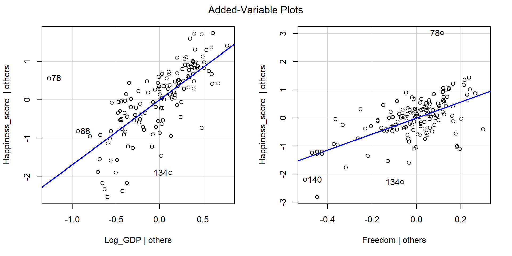

## Today's Packages and Data 🤗

:::: {.columns}
::: {.column width="60%"}

<center> **Data** </center>

Let's continue with the example from  [Lab 4](https://raw.githack.com/quinix45/PSYC-7804-Regression-Lab-Slides/main/Slides%20Files/Lab%204.html#/variables-of-interest){target="_blank"}


::: {.cell .code-125}

```{.r .cell-code  code-line-numbers="false"}
WH_2024 <- rio::import("https://github.com/quinix45/PSYC-7804-Regression-Lab-Slides/raw/refs/heads/main/Slides%20Files/Data/World_happiness_2024.csv")

# let's peak at our variables
str(WH_2024, vec.len = 2)
```

::: {.cell-output .cell-output-stdout}

```
'data.frame':	140 obs. of  9 variables:
 $ Country_name           : chr  "Finland" "Denmark" ...
 $ Region                 : chr  "Western Europe" "Western Europe" ...
 $ Happiness_score        : num  7.74 7.58 ...
 $ Log_GDP                : num  1.84 1.91 ...
 $ Social_support         : num  1.57 1.52 ...
 $ Healthy_life_expectancy: num  0.695 0.699 0.718 0.724 0.74 ...
 $ Freedom                : num  0.859 0.823 0.819 0.838 0.641 ...
 $ Generosity             : num  0.142 0.204 0.258 0.221 0.153 ...
 $ Corruption             : num  0.454 0.452 0.818 0.476 0.807 ...
```


:::
:::


:::
::: {.column width="40%"}

<br>


::: {.cell .code-125}

```{.r .cell-code  code-line-numbers="false"}
# get the variable we are using in a single object
# not needed, but makes things cleaner

reg_vars <- WH_2024[, c("Happiness_score",
                        "Log_GDP",
                        "Freedom")]
```
:::


And let's load good old `tidyverse`


::: {.cell .code-125}

```{.r .cell-code  code-line-numbers="false"}
library(tidyverse)
theme_set(theme_classic(base_size = 14, 
                        base_family = 'serif'))
```
:::


:::
::::


## Partial regression coefficients

In [Lab 4](https://raw.githack.com/quinix45/PSYC-7804-Regression-Lab-Slides/main/Slides%20Files/Lab%204.html){target="_blank"}
, we used `Log_GDP` and `Freedom` to predict `Happiness_score`. We observed that the results were very different when we use both variables together compared to when we look at them separately

:::: {.columns}
::: {.column width="50%"}


::: {.fragment fragment-index=1}

The intercept and slopes with both predictors in the model


::: {.cell .code-125}

```{.r .cell-code  code-line-numbers="false"}
reg_full <- lm(Happiness_score ~ Log_GDP + Freedom, 
          reg_vars)

coef(reg_full)
```

::: {.cell-output .cell-output-stdout}

```
(Intercept)     Log_GDP     Freedom 
   1.437184    1.682053    2.859202 
```


:::
:::


:::

:::
::: {.column width="50%"}

::: {.fragment fragment-index=2}

The intercept and slopes with separate models with one predictor are quite different


::: {.cell .code-125}

```{.r .cell-code  code-line-numbers="false"}
reg_free <- lm(Happiness_score ~ Freedom, 
              reg_vars)
coef(reg_free)
```

::: {.cell-output .cell-output-stdout}

```
(Intercept)     Freedom 
   2.623351    4.684888 
```


:::

```{.r .cell-code  code-line-numbers="false"}
reg_GDP <- lm(Happiness_score ~ Log_GDP, 
              reg_vars)
coef(reg_GDP)
```

::: {.cell-output .cell-output-stdout}

```
(Intercept)     Log_GDP 
   2.586466    2.135488 
```


:::
:::


:::

:::
::::

<br>

::: {.fragment fragment-index=3}

The catch is that the model that includes both predictors calculates **partial regression coefficients**.

:::

## Calculate partial regression coefficients "By Hand"

Personally, the concept of **partial regression coefficients** starts making sense once I "computed" them myself and see what is going on behind the scenes. 

:::: {.columns}
::: {.column width="50%"}

::: {.fragment fragment-index=1}

Partial regression coefficient for `Log_GDP`


::: {.cell .code-125}

```{.r .cell-code  code-line-numbers="false"}
resid_happy_Free <- residuals(lm(Happiness_score ~ Freedom, 
               reg_vars))

resid_GDP <- residuals(lm(Log_GDP ~ Freedom, 
              reg_vars))

# the 0 + takes out the intercept, which is exactly 0 anyway in this case 
coef(lm(resid_happy_Free ~ 0 + resid_GDP))
```

::: {.cell-output .cell-output-stdout}

```
resid_GDP 
 1.682053 
```


:::
:::


:::

:::
::: {.column width="50%"}

::: {.fragment fragment-index=2}

Partial regression coefficient for `Freedom`


::: {.cell .code-125}

```{.r .cell-code  code-line-numbers="false"}
resid_happy_GDP <- residuals(lm(Happiness_score ~ Log_GDP, 
               reg_vars))

resid_Free <- residuals(lm(Freedom ~ Log_GDP, 
              reg_vars))

# the 0 + takes out the intercept, which is exactly 0 anyway in this case 
coef(lm(resid_happy_GDP ~ 0 + resid_Free))
```

::: {.cell-output .cell-output-stdout}

```
resid_Free 
  2.859202 
```


:::
:::


:::
:::
::::

::: {.fragment fragment-index=3}

So, when you run multiple regression, all your slopes are calculated based on the residuals *after accounting for all the other variables in the model*.

:::

## Added variable plots 

Then, added variables plots are simply plots between the residuals of one the predictors and $Y$ that result by taking out the variance explained by all the other variables. 

::: {.fragment fragment-index=1}

:::: {.columns}
::: {.column width="50%"}


::: {.cell .code-125}

```{.r .cell-code  code-line-numbers="false"}
ggplot() +
  geom_point(aes(y = resid_happy_Free, 
                 x = resid_GDP))
```

::: {.cell-output-display}
{width=960}
:::
:::


:::
::: {.column width="50%"}


::: {.cell .code-125}

```{.r .cell-code  code-line-numbers="false"}
ggplot() +
  geom_point(aes(y = resid_happy_GDP, 
                 x = resid_Free))
```

::: {.cell-output-display}
{width=960}
:::
:::


:::
::::

The slopes that you get when you include both predictors are the slopes for the lines of best fit these 2 plots.

:::

## The Quick way: `avPlots()` function from `car`  

:::: {.columns}
::: {.column width="75%"}


::: {.cell .code-125}

```{.r .cell-code  code-line-numbers="false"}
car::avPlots(reg_full)
```

::: {.cell-output-display}
{width=960}
:::
:::


:::
::: {.column width="25%"}

To get added variable plots in practice you would use the `avPlot()` function. 

::: {.fragment fragment-index=1}

When you have more than 2 predictors, it is not possible to build a visualization of all variables at once like a 3D plot. Added variable plots can help you visualize regression results no matter the number of predictors!

:::

:::
::::


## Bootstrapping

Bootstrapping [@Efron_1992] is a really smart idea to calculate confidence intervals while avoid doing math! You probably have seen some complicated equations that need to be derived to calculate confidence intervals for statistics (e.g., see [here](https://agleontyev.netlify.app/post/2019-09-05-calculating-r-squared-confidence-intervals/){target="_blank"}
for the 95\% CI of $R^2$).

::: {.fragment fragment-index=1}
Turns out that even more complex math goes behind deriving the complicated equations 😱 Usually, that involves figuring out what is the theoretical sampling distribution of a certain statistic for an infinite number of experiments.  
:::


::: {.fragment fragment-index=2}
Instead bootstrapping says:


:::


## "By Hand" Example of Bootstrapping

As always, we can do things ourselves to get a better understanding of the process.

:::: {.columns}
::: {.column width="40%"}

::: {.fragment fragment-index=1}


::: {.cell .code-125}

```{.r .cell-code  code-fold="true" code-summary="Bootstrap $R^2$ code" code-line-numbers="false"}
# empty element to save R^2 to
r_squared <- c()

set.seed(34677)

for(i in 1:2000){

# sample from data 
sample <- sample(1:nrow(reg_vars), 
                 replace = TRUE)  

dat_boot <- reg_vars[sample,]

# Run regression
reg_boot <- lm(Happiness_score ~ Log_GDP + Freedom, 
               dat_boot)  

# Save R^2
r_squared[i] <- summary(reg_boot)$r.squared
}
```
:::


:::

::: {.fragment fragment-index=2}
<div style="font-size: 24px">  
There is a lot of value in understanding how the code above works, but the main point is that we are running the same regression 2000 times with a different sample from our data, and then saving the $R^2$ that we get every time. 
</div>
:::


::: {.fragment fragment-index=3}

The $R^2$ from our regression with both variables was


::: {.cell .code-125}

```{.r .cell-code  code-line-numbers="false"}
summary(reg_full)$r.squared
```

::: {.cell-output .cell-output-stdout}

```
[1] 0.7186638
```


:::
:::


:::

:::
::: {.column width="60%"}

::: {.fragment fragment-index=4}

If we look out the distribution of the all the 2000 $R^2$ we get 


::: {.cell}

```{.r .cell-code  code-line-numbers="false"}
# need to run bootstrap code on the left first
hist(r_squared)
```

::: {.cell-output-display}
{width=80%}
:::
:::

::: {.cell}

```{.r .cell-code  code-line-numbers="false"}
quantile(r_squared, c(.025, .5, .975))
```

::: {.cell-output .cell-output-stdout}

```
     2.5%       50%     97.5% 
0.6131015 0.7291690 0.8139789 
```


:::
:::


:::
:::
::::

## The Quick way: `Boot()` function from `car`  

Once again, the `car` package comes to the rescue

:::: {.columns}
::: {.column width="50%"}


::: {.cell .code-125}

```{.r .cell-code  code-line-numbers="false"}
set.seed(875)
boot_model <- car::Boot(reg_full, R = 2000)

confint(boot_model, type = "perc")
```

::: {.cell-output .cell-output-stdout}

```
Bootstrap percent confidence intervals

                2.5 %   97.5 %
(Intercept) 0.8712328 1.993144
Log_GDP     1.2646729 2.094521
Freedom     1.8735919 3.724216
```


:::
:::


The confidence interval for $R^2$ is a bit annoying to get from `car`, so here we just have the CIs for intercept and slopes

:::
::: {.column width="50%"}

::: {.fragment fragment-index=1}

These are our normal confidence intervals from the regression:


::: {.cell .code-125}

```{.r .cell-code  code-line-numbers="false"}
confint(reg_full)
```

::: {.cell-output .cell-output-stdout}

```
                2.5 %   97.5 %
(Intercept) 0.9769482 1.897419
Log_GDP     1.4083851 1.955721
Freedom     2.1432532 3.575151
```


:::
:::


:::

:::
::::

::: {.fragment fragment-index=2}
Bootstrapping becomes more and more accurate as sample size increases. Here it may not be as accurate because we only have 140 observations, although it seems to do alright.
:::

## Visualizing Bootstrap Results

You can also visualize the distribution of the bootstrapped samples for the regression slopes.

<div style="font-size: 22px; padding-bottom: 6px;"> **NOTE**: You need to provide the names of the regression slopes as shown in the `summary()` output through the `parm=` argument 
 </div>


:::: {.columns}
::: {.column width="50%"}


::: {.cell .code-125}

```{.r .cell-code  code-line-numbers="false"}
hist(boot_model, 
     parm = "Log_GDP")
```

::: {.cell-output-display}
{width=960}
:::
:::


:::

::: {.column width="50%"}


::: {.cell .code-125}

```{.r .cell-code  code-line-numbers="false"}
hist(boot_model, 
     parm = "Freedom")
```

::: {.cell-output-display}
{width=960}
:::
:::


:::
::::


::: {.fragment fragment-index=1}
Notice that the bootstrap samples are very normally distributed. This is almost always the case for regression slopes. In contrast, statistics like $R^2$ will not be normally distributed as we saw 2 slides ago. 
:::


## References 

<div id="refs"> </div>


